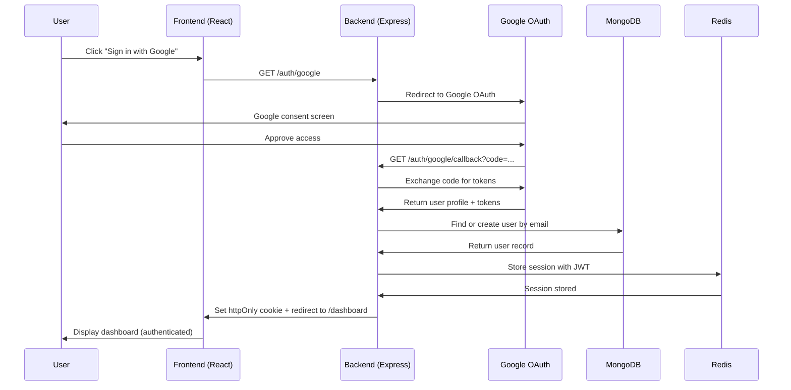
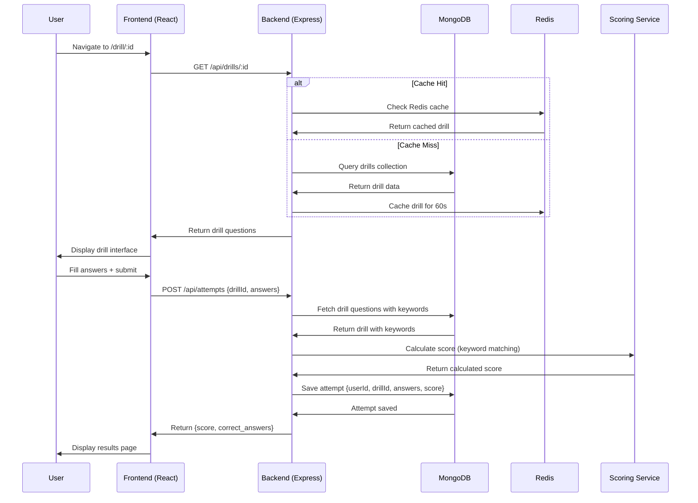
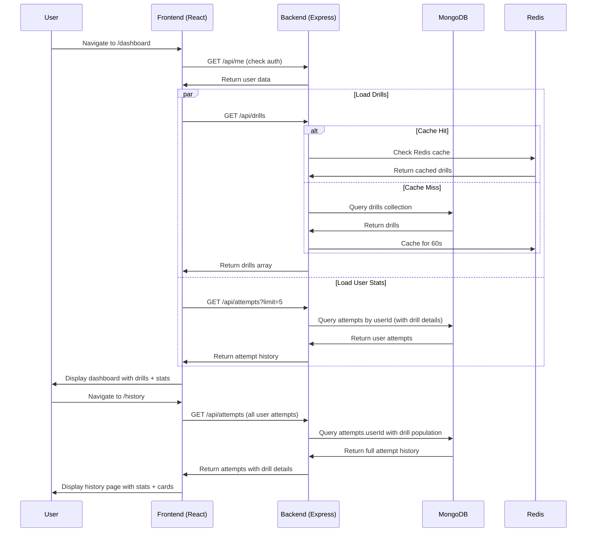
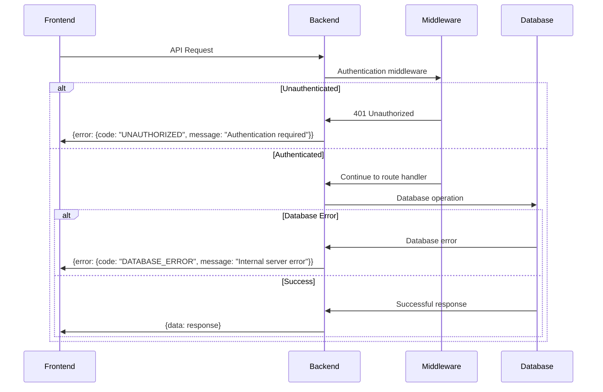
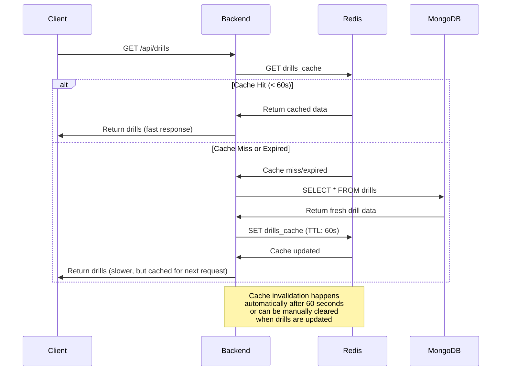

# Sequence Diagrams

## 1. Google OAuth Authentication Flow

```mermaid
sequenceDiagram
    participant U as User
    participant F as Frontend (React)
    participant B as Backend (Express)
    participant G as Google OAuth
    participant DB as MongoDB
    participant R as Redis

    U->>F: Click "Sign in with Google"
    F->>B: GET /auth/google
    B->>G: Redirect to Google OAuth
    G->>U: Google consent screen
    U->>G: Approve access
    G->>B: GET /auth/google/callback?code=...
    B->>G: Exchange code for tokens
    G->>B: Return user profile + tokens
    B->>DB: Find or create user by email
    DB->>B: Return user record
    B->>R: Store session with JWT
    R->>B: Session stored
    B->>F: Set httpOnly cookie + redirect to /dashboard
    F->>U: Display dashboard (authenticated)
```

## 2. Taking a Drill Flow

```mermaid
sequenceDiagram
    participant U as User
    participant F as Frontend (React)
    participant B as Backend (Express)
    participant DB as MongoDB
    participant R as Redis
    participant S as Scoring Service

    U->>F: Navigate to /drill/:id
    F->>B: GET /api/drills/:id
    
    alt Cache Hit
        B->>R: Check Redis cache
        R->>B: Return cached drill
    else Cache Miss
        B->>DB: Query drills collection
        DB->>B: Return drill data
        B->>R: Cache drill for 60s
    end
    
    B->>F: Return drill questions
    F->>U: Display drill interface
    
    U->>F: Fill answers + submit
    F->>B: POST /api/attempts {drillId, answers}
    B->>DB: Fetch drill questions with keywords
    DB->>B: Return drill with keywords
    B->>S: Calculate score (keyword matching)
    S->>B: Return calculated score
    B->>DB: Save attempt {userId, drillId, answers, score}
    DB->>B: Attempt saved
    B->>F: Return {score, correct_answers}
    F->>U: Display results page
```

## 3. Dashboard + History Loading

```mermaid
sequenceDiagram
    participant U as User
    participant F as Frontend (React)
    participant B as Backend (Express)
    participant DB as MongoDB
    participant R as Redis

    U->>F: Navigate to /dashboard
    F->>B: GET /api/me (check auth)
    B->>F: Return user data
    
    par Load Drills
        F->>B: GET /api/drills
        alt Cache Hit
            B->>R: Check Redis cache
            R->>B: Return cached drills
        else Cache Miss
            B->>DB: Query drills collection
            DB->>B: Return drills
            B->>R: Cache for 60s
        end
        B->>F: Return drills array
    and Load User Stats
        F->>B: GET /api/attempts?limit=5
        B->>DB: Query attempts by userId (with drill details)
        DB->>B: Return user attempts
        B->>F: Return attempt history
    end
    
    F->>U: Display dashboard with drills + stats
    
    U->>F: Navigate to /history
    F->>B: GET /api/attempts (all user attempts)
    B->>DB: Query attempts.userId with drill population
    DB->>B: Return full attempt history
    B->>F: Return attempts with drill details
    F->>U: Display history page with stats + cards
```

## 4. API Error Handling Flow

```mermaid
sequenceDiagram
    participant F as Frontend
    participant B as Backend
    participant M as Middleware
    participant DB as Database

    F->>B: API Request
    B->>M: Authentication middleware
    
    alt Unauthenticated
        M->>B: 401 Unauthorized
        B->>F: {error: {code: "UNAUTHORIZED", message: "Authentication required"}}
    else Authenticated
        M->>B: Continue to route handler
        B->>DB: Database operation
        
        alt Database Error
            DB->>B: Database error
            B->>F: {error: {code: "DATABASE_ERROR", message: "Internal server error"}}
        else Success
            DB->>B: Successful response
            B->>F: {data: response}
        end
    end
```

## 5. Performance Caching Strategy

```mermaid
sequenceDiagram
    participant C as Client
    participant B as Backend
    participant R as Redis
    participant DB as MongoDB

    C->>B: GET /api/drills
    B->>R: GET drills_cache
    
    alt Cache Hit (< 60s)
        R->>B: Return cached data
        B->>C: Return drills (fast response)
    else Cache Miss or Expired
        R->>B: Cache miss/expired
        B->>DB: SELECT * FROM drills
        DB->>B: Return fresh drill data
        B->>R: SET drills_cache (TTL: 60s)
        R->>B: Cache updated
        B->>C: Return drills (slower, but cached for next request)
    end

    Note over B,R: Cache invalidation happens<br/>automatically after 60 seconds<br/>or can be manually cleared<br/>when drills are updated
```
